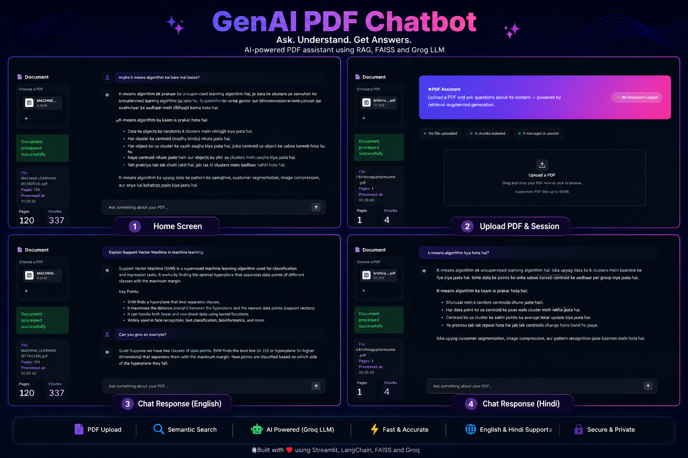

# 📄 PDF Assistant – RAG Chatbot

AI-powered PDF Question Answering System built using **Streamlit**, **FAISS**, **Sentence Transformers**, and **Groq Llama 3.3** with Retrieval-Augmented Generation (RAG).



---

## 🚀 Features

- 📄 Upload any PDF
- 🤖 AI-powered Question Answering
- 🔍 Semantic Search using FAISS
- 🧠 Groq Llama 3.3 LLM
- 🌐 English & Hindi Support
- ⚡ Retrieval-Augmented Generation (RAG)
- 🎨 Modern Streamlit UI

---

## 🛠️ Tech Stack

- Python
- Streamlit
- FAISS
- Sentence Transformers
- Groq API
- LangChain
- NumPy

---

## 📂 Project Structure

```text
genai-pdf-chatbot
│
├── app.py
├── README.md
├── requirements.txt
├── .env.example
│
├── assets
│   └── project-overview.png
│
├── src
│   ├── embedding.py
│   ├── llm.py
│   ├── pdf_loader.py
│   ├── retriever.py
│   ├── text_splitter.py
│   ├── utils.py
│   └── vector_store.py
```

## ▶️ Run Locally

```bash
git clone https://github.com/krishna6391824655-eng/genai-pdf-chatbot.git

cd genai-pdf-chatbot

pip install -r requirements.txt

streamlit run app.py
```

## ⭐ If you like this project

Give it a ⭐ on GitHub.